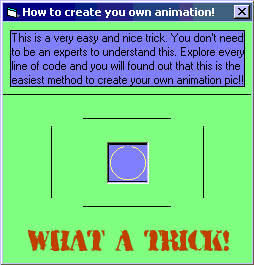



## The easiest way in the world to make your own animation\! A MUST\-SEE Code\!\!\!

### Description

This CODE (not article) will guide you to the easiest way in the world to build and customize your OWN animation! Take very short time to download and ALL code are include! Please download, leave comments, and please don't forget to vote.
 
### More Info
 
Picture

Animation

Beware, don't fall down in its beautifulness.

             |
---                |---
**Submitted On**   |2000-11-25 21:33:00
**By**             |[Alph@\!](https://github.com/Planet-Source-Code/PSCIndex/blob/master/ByAuthor/alph.md)
**Level**          |Advanced
**User Rating**    |4.4 (44 globes from 10 users)
**Compatibility**  |VB 5\.0, VB 6\.0
**Category**       |[Graphics](https://github.com/Planet-Source-Code/PSCIndex/blob/master/ByCategory/graphics__1-46.md)
**World**          |[Visual Basic](https://github.com/Planet-Source-Code/PSCIndex/blob/master/ByWorld/visual-basic.md)
**Archive File**   |[CODE\_UPLOAD1205111252000\.zip](https://github.com/Planet-Source-Code/alph-the-easiest-way-in-the-world-to-make-your-own-animation-a-must-see-code__1-13108/archive/master.zip)

